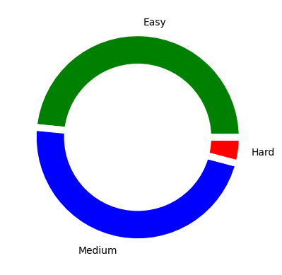

<a href ="https://github.com/Jiganesh/High-On-DSA/blob/main/.dev/allProblemsSolved.md"></a>   


*Click below to expand  and view problems.*



<details>


<summary>Arrays</summary>

- https://leetcode.com/problems/3sum/ ```Medium```
- https://leetcode.com/problems/add-to-array-form-of-integer/ ```Easy```
- https://leetcode.com/problems/all-divisions-with-the-highest-score-of-a-binary-array/ ```Medium```
- https://leetcode.com/problems/build-array-from-permutation/ ```Easy```
- https://leetcode.com/problems/cells-with-odd-values-in-a-matrix/ ```Easy```
- https://leetcode.com/problems/check-if-every-row-and-column-contains-all-numbers/ ```Easy```
- https://leetcode.com/problems/check-if-the-sentence-is-pangram/ ```Easy```
- https://leetcode.com/problems/combination-sum/ ```Medium```
- https://leetcode.com/problems/concatenation-of-array/ ```Easy```
- https://leetcode.com/problems/contiguous-array/ ```Medium```
- https://leetcode.com/problems/count-elements-with-strictly-smaller-and-greater-elements/ ```Easy```
- https://leetcode.com/problems/count-items-matching-a-rule/ ```Easy```
- https://leetcode.com/problems/create-target-array-in-the-given-order/ ```Easy```
- https://leetcode.com/problems/determine-whether-matrix-can-be-obtained-by-rotation/ ```Easy```
- https://leetcode.com/problems/find-all-lonely-numbers-in-the-array/  ```Medium```
- https://leetcode.com/problems/find-first-and-last-position-of-element-in-sorted-array/ ```Medium```
- https://leetcode.com/problems/find-first-palindromic-string-in-the-array/ ```Easy```
- https://leetcode.com/problems/find-n-unique-integers-sum-up-to-zero/ ```Easy```
- https://leetcode.com/problems/find-numbers-with-even-number-of-digits/ ```Easy```
- https://leetcode.com/problems/find-the-highest-altitude/ ```Easy```
- https://leetcode.com/problems/flipping-an-image/ ```Easy```
- https://leetcode.com/problems/house-robber/ ```Medium```
- https://leetcode.com/problems/how-many-numbers-are-smaller-than-the-current-number/ ```Easy```
- https://leetcode.com/problems/intersection-of-two-arrays-ii/ ```Easy```
- https://leetcode.com/problems/jump-game/ ```Medium```
- https://leetcode.com/problems/keep-multiplying-found-values-by-two/ ```Easy```
- https://leetcode.com/problems/kids-with-the-greatest-number-of-candies/ ```Easy```
- https://leetcode.com/problems/kids-with-the-greatest-number-of-candies/ ```Easy```
- https://leetcode.com/problems/lucky-numbers-in-a-matrix/ ```Easy```
- https://leetcode.com/problems/majority-element/ ```Easy```
- https://leetcode.com/problems/matrix-diagonal-sum/ ```Easy```
- https://leetcode.com/problems/matrix-diagonal-sum/ ```Easy```
- https://leetcode.com/problems/maximize-distance-to-closest-person/ ```Medium```
- https://leetcode.com/problems/maximum-population-year/ ```Easy```
- https://leetcode.com/problems/maximum-subarray/ ```Easy```
- https://leetcode.com/problems/median-of-two-sorted-arrays/ ```Hard```
- https://leetcode.com/problems/merge-sorted-array/ ```Easy```
- https://leetcode.com/problems/minimum-swaps-to-group-all-1s-together-ii/ ```Medium```
- https://leetcode.com/problems/number-of-good-pairs/ ```Easy```
- https://leetcode.com/problems/number-of-smooth-descent-periods-of-a-stock/ ```Medium```
- https://leetcode.com/problems/partition-array-according-to-given-pivot/ ```Medium```
- https://leetcode.com/problems/pascals-triangle/ ```Easy```
- https://leetcode.com/problems/permutations-ii/ ```Medium``` ```Recursion```
- https://leetcode.com/problems/plus-one/ ```Easy```
- https://leetcode.com/problems/product-of-array-except-self/ ```Medium```
- https://leetcode.com/problems/rearrange-array-elements-by-sign/ ```Medium```
- https://leetcode.com/problems/remove-duplicates-from-sorted-array/ ```Easy```
- https://leetcode.com/problems/reshape-the-matrix/ ```Easy```
- https://leetcode.com/problems/richest-customer-wealth/ ```Easy```
- https://leetcode.com/problems/rotate-array/ ```Medium```
- https://leetcode.com/problems/running-sum-of-1d-array/ ```Easy```
- https://leetcode.com/problems/set-matrix-zeroes/ ```Medium```
- https://leetcode.com/problems/shuffle-the-array/ ```Easy```
- https://leetcode.com/problems/sort-colors/ ```Medium```
- https://leetcode.com/problems/spiral-matrix-ii/ ```Medium```
- https://leetcode.com/problems/largest-positive-integer-that-exists-with-its-negative/ ```Medium```
- https://leetcode.com/problems/valid-mountain-array/ ```Easy```
- https://leetcode.com/problems/find-all-k-distant-indices-in-an-array/ ```Easy``` ```Recommended```
- https://leetcode.com/problems/get-the-maximum-score/ ```Hard```
- https://leetcode.com/problems/count-number-of-pairs-with-absolute-difference-k/ ```Easy```
- https://leetcode.com/problems/next-permutation/ ```Medium```
- https://leetcode.com/problems/3sum-with-multiplicity/ ```Medium```
- https://leetcode.com/problems/baseball-game/   ```Easy```
- https://leetcode.com/problems/shift-2d-grid/ ```Easy```
- https://leetcode.com/problems/game-of-life/ ```Medium```
- https://leetcode.com/problems/move-zeroes/ ```Easy```
- https://leetcode.com/problems/find-the-k-beauty-of-a-number/ ```Easy```
- https://leetcode.com/problems/squares-of-a-sorted-array/ ```Easy```
- https://leetcode.com/problems/pascals-triangle-ii/ ```Easy```
- https://leetcode.com/problems/partition-array-such-that-maximum-difference-is-k/ ```Medium```
- https://leetcode.com/problems/calculate-amount-paid-in-taxes/ ```Easy```
- https://leetcode.com/problems/check-if-matrix-is-x-matrix/ ```Easy```
- https://leetcode.com/problems/convert-1d-array-into-2d-array/ ```Easy```
- https://leetcode.com/problems/rotate-image/ ```Medium```
- https://leetcode.com/problems/island-perimeter/ ```Easy```
- https://leetcode.com/problems/diagonal-traverse/ ```Medium```
- https://leetcode.com/problems/diagonal-traverse/ ```Medium```
- https://leetcode.com/problems/alphabet-board-path/ ```Medium```
- https://leetcode.com/problems/the-employee-that-worked-on-the-longest-task/ ```Easy```
- https://leetcode.com/problems/largest-positive-integer-that-exists-with-its-negative/ ```Easy```
- https://leetcode.com/problems/check-if-two-string-arrays-are-equivalent/ ```Easy```
- https://leetcode.com/problems/print-words-vertically/ ```Medium```
- https://leetcode.com/problems/max-consecutive-ones/ ```Easy```
- https://leetcode.com/problems/shortest-distance-to-target-string-in-a-circular-array/ ```Easy```


</details>


<details>
<summary>Bit Manipulation</summary>

- https://leetcode.com/problems/binary-number-with-alternating-bits/ ```Easy```
- https://leetcode.com/problems/number-of-steps-to-reduce-a-number-to-zero/ ```Easy```
- https://leetcode.com/problems/single-number/ ```Easy```
- https://leetcode.com/problems/check-if-a-string-contains-all-binary-codes-of-size-k/ ```Medium```
- https://leetcode.com/problems/maximum-product-of-word-lengths/ ```Medium```
- https://leetcode.com/problems/divide-two-integers/ ```Medium```
- https://leetcode.com/problems/longest-nice-subarray/ ```Medium```
- https://leetcode.com/problems/longest-subarray-with-maximum-bitwise-and/ ```Medium```
- https://leetcode.com/problems/decode-xored-array/description/ ```Easy``
- https://leetcode.com/problems/number-of-steps-to-reduce-a-number-to-zero/ ```Easy```
- https://leetcode.com/problems/xor-operation-in-an-array/description/ ```Easy```
- https://leetcode.com/problems/find-the-original-array-of-prefix-xor/ ```Medium```
- https://leetcode.com/problems/binary-number-with-alternating-bits/ ```Medium```

</details>


<details>
<summary>Backtracking</summary>

- https://leetcode.com/problems/generate-parentheses/ ```Medium```
- https://leetcode.com/problems/combination-sum/ ```Medium```
- https://leetcode.com/problems/combination-sum-ii/  ```Medium``` 
- https://leetcode.com/problems/n-queens/ ```Hard```
- https://leetcode.com/problems/n-queens-ii/  ```Hard```
- https://leetcode.com/problems/combinations/ ```Medium```
- https://leetcode.com/problems/matchsticks-to-square```Medium```
- https://leetcode.com/problems/maximum-rows-covered-by-columns/ ```Medium```

</details>

<details>
<summary>Design</summary>

- https://leetcode.com/problems/design-an-atm-machine/ ```Medium```
- https://leetcode.com/problems/min-stack/ ```Easy```
- https://leetcode.com/problems/design-hashset/ ```Easy```
- https://leetcode.com/problems/design-hashmap/  ```Easy```
- https://leetcode.com/problems/encode-and-decode-tinyurl/ ``` Medium```
- https://leetcode.com/problems/peeking-iterator/ ```Medium```
- https://leetcode.com/problems/implement-stack-using-queues/ ```Easy```
- https://leetcode.com/problems/fair-distribution-of-cookies/submissions/ ```Medium```
- https://leetcode.com/problems/display-table-of-food-orders-in-a-restaurant/ ```Medium```
- https://leetcode.com/problems/design-browser-history/ ```Medium```
- https://leetcode.com/problems/design-front-middle-back-queue/ ```Medium```


</details>


<details>
<summary>Dynamic Programming</summary>

- https://leetcode.com/problems/coin-change/ ```Medium```
- https://leetcode.com/problems/coin-change-2/ ```Medium```
- https://leetcode.com/problems/arithmetic-slices/ ```Medium```
- https://leetcode.com/problems/champagne-tower/ ```Medium```
- https://leetcode.com/problems/best-time-to-buy-and-sell-stock/  ```Easy```
- https://leetcode.com/problems/climbing-stairs/ ```Easy```
- https://leetcode.com/problems/n-th-tribonacci-number/ ```Easy```
- https://leetcode.com/problems/divisor-game/ ```Easy```
- https://leetcode.com/problems/min-cost-climbing-stairs/ ```Easy```
- https://leetcode.com/problems/longest-increasing-subsequence/ ```Medium```
- https://practice.geeksforgeeks.org/problems/max-sum-without-adjacents2430/1 ```Easy```
- https://leetcode.com/problems/delete-and-earn/ ```Medium```
- https://leetcode.com/problems/number-of-smooth-descent-periods-of-a-stock/ ```Medium```
- https://leetcode.com/problems/counting-bits/ ```Easy``` ```Bit Manipulation```
- https://leetcode.com/problems/integer-break/ ```Medium```
- https://leetcode.com/problems/minimum-cost-for-tickets/ ```Medium```
- https://leetcode.com/problems/decode-ways/ ```Medium```
- https://practice.geeksforgeeks.org/problems/subset-sum-problem-1611555638/1/ ```Medium``` ```Recommended```
- https://leetcode.com/problems/partition-equal-subset-sum/ ```Medium```
- https://practice.geeksforgeeks.org/problems/perfect-sum-problem5633/1# ```Medium``` ```Standard```
- https://leetcode.com/problems/target-sum/ ```Medium``` ```Recommended```
- https://www.codingninjas.com/codestudio/problems/rod-cutting-problem_800284 ```Medium```
- https://leetcode.com/problems/longest-common-subsequence/ ```Medium``` ```Standard```
- https://leetcode.com/problems/letter-combinations-of-a-phone-number/ ```Medium```
- https://leetcode.com/problems/delete-operation-for-two-strings/ ```Medium```
- https://leetcode.com/problems/minimum-ascii-delete-sum-for-two-strings/ ```Medium```
- https://leetcode.com/problems/n-th-tribonacci-number/te-sum-for-two-strings/ ```Medium```
- https://leetcode.com/problems/longest-palindromic-subsequence/ ```Medium```
- https://leetcode.com/problems/jump-game-ii/ ```Medium```
- https://leetcode.com/problems//minimum-insertion-steps-to-make-a-string-palindrome/ ```Hard```
- https://leetcode.com/problems/shortest-common-supersequence/ ```Hard```
- https://leetcode.com/problems/palindrome-partitioning/ ```Medium```
- https://leetcode.com/problems/palindrome-partitioning-ii/ ```Hard```
- https://leetcode.com/problems/perfect-squares/ ```Medium```
- https://leetcode.com/problems/number-of-ways-to-buy-pens-and-pencils/ ```Medium```
- https://leetcode.com/problems/count-sorted-vowel-strings/ ```Medium```
- https://leetcode.com/problems/get-maximum-in-generated-array/ ```Easy```
- https://leetcode.com/problems/unique-paths-ii/ ```Medium```
- https://leetcode.com/problems/palindromic-substrings/ ```Medium```
- https://leetcode.com/problems/concatenated-words/ ```Hard```
- https://leetcode.com/problems/word-break/ ```Medium```
- https://leetcode.com/problems/word-break-ii/ ```Hard```
- https://leetcode.com/problems/unique-paths/ ```Medium```
- https://leetcode.com/problems/triangle/ ```Medium```
- https://leetcode.com/problems/minimum-path-cost-in-a-grid/ ```Medium```
- https://leetcode.com/problems/edit-distance/ ```Hard```
- https://leetcode.com/problems/longest-string-chain/ ```Medium```
- https://leetcode.com/problems/maximum-profit-in-job-scheduling/ ```Hard```
- https://leetcode.com/problems/maximum-earnings-from-taxi/ ```Medium```
- https://leetcode.com/problems/jump-game/ ```Medium```https://leetcode.com/problems/string-compression/
- https://leetcode.com/problems/time-needed-to-rearrange-a-binary-string/ ```Medium```
- https://leetcode.com/problems/minimum-path-sum/ ```Medium```
- https://leetcode.com/problems/fibonacci-number/ ```Easy```
- https://leetcode.com/problems/length-of-longest-fibonacci-subsequence/  ```Medium```
- https://leetcode.com/problems/interleaving-string/ ```Medium```
- https://leetcode.com/problems/out-of-boundary-paths/ ```Medium```
- https://leetcode.com/problems/knight-probability-in-chessboard/ ```Medium```
- https://leetcode.com/problems/check-if-there-is-a-valid-partition-for-the-array/ ```Medium```
- https://leetcode.com/problems/k-concatenation-maximum-sum/ ```Medium```
- https://leetcode.com/problems/number-of-ways-to-reach-a-position-after-exactly-k-steps/ ```Medium```
- https://leetcode.com/problems/count-square-submatrices-with-all-ones/ ```Medium```
- https://leetcode.com/problems/all-possible-full-binary-trees/ ```Medium```
- https://leetcode.com/problems/minimum-number-of-removals-to-make-mountain-array/  ```Hard```
- https://leetcode.com/problems/max-dot-product-of-two-subsequences/ ```Medium```
- https://leetcode.com/problems/number-of-dice-rolls-with-target-sum/ ```Medium```
- https://leetcode.com/problems/where-will-the-ball-fall/ ```Medium```


</details>


<details>
<summary>Graphs</summary>

- https://leetcode.com/problems/flood-fill/  ```Easy```
- https://leetcode.com/problems/is-graph-bipartite/ ```Medium```
- https://leetcode.com/problems/jump-game-vii/  ```Medium```
- https://leetcode.com/problems/find-center-of-star-graph/ ```Easy```
- https://leetcode.com/problems/reachable-nodes-with-restrictions/ ```Medium```
- https://leetcode.com/problems/snakes-and-ladders/ ```Medium```
- https://leetcode.com/problems/max-area-of-island/ ```Medium```
- https://leetcode.com/problems/minimum-jumps-to-reach-home/ ```Medium```
- https://leetcode.com/problems/lexicographical-numbers/ ```Medium```
- https://leetcode.com/problems/word-search/ ```Medium```
- https://leetcode.com/problems/find-if-path-exists-in-graph/ ```Easy```
- https://leetcode.com/problems/find-the-town-judge/ ```Easy```
- https://leetcode.com/problems/minimum-number-of-vertices-to-reach-all-nodes/ ```Medium```
- https://leetcode.com/problems/all-paths-from-source-to-target/ ```Medium```
- https://leetcode.com/problems/keys-and-rooms/ ```Medium```
- https://leetcode.com/problems/pacific-atlantic-water-flow/ ```Medium```
- https://leetcode.com/problems/numbers-with-same-consecutive-differences/ ```Medium```
- https://leetcode.com/problems/minimum-genetic-mutation/ ```Medium```
- https://leetcode.com/problems/nearest-exit-from-entrance-in-maze/ ```Medium```
- https://leetcode.com/problems/minimum-score-of-a-path-between-two-cities/ ```Medium```
- https://leetcode.com/problems/unique-paths-iii/ ```Hard```


</details>


<details>
<summary>Greedy</summary>

- https://leetcode.com/problems/can-place-flowers/ ```Easy```
- https://leetcode.com/problems/container-with-most-water/   ```Medium```
- https://leetcode.com/problems/minimum-number-of-arrows-to-burst-balloons/ ```Medium```
- https://leetcode.com/problems/non-overlapping-intervals/ ```Medium```
- https://leetcode.com/problems/merge-intervals/ ```Medium```
- https://leetcode.com/problems/remove-covered-intervals/ ```Medium```
- https://leetcode.com/problems/teemo-attacking/ ```Easy```
- https://leetcode.com/problems/gas-station/ ```Easy```
- https://leetcode.com/problems/last-stone-weight/ ```Easy```
- https://leetcode.com/problems/partition-labels/ ```Medium```
- https://leetcode.com/problems/smallest-string-with-a-given-numeric-value/ ```Medium```
- https://leetcode.com/problems/broken-calculator/ ```Medium```
- https://leetcode.com/problems/boats-to-save-people/ ```Medium```
- https://leetcode.com/problems/two-city-scheduling/ ```Medium```
- https://leetcode.com/problems/container-with-most-water/ ```Medium```
- https://leetcode.com/problems/minimum-number-of-operations-to-convert-time/ ```Easy```
- https://leetcode.com/problems/minimum-rounds-to-complete-all-tasks/ ```Medium```
- https://leetcode.com/problems/removing-minimum-and-maximum-from-array/ ```Medium```
- https://leetcode.com/problems/partitioning-into-minimum-number-of-deci-binary-numbers/ ```Medium```
- https://leetcode.com/problems/largest-number/ ```Medium```
- https://leetcode.com/problems/smallest-value-of-the-rearranged-number/ ```Medium``` 
- https://leetcode.com/problems/minimum-moves-to-equal-array-elements/ ```Medium```
- https://leetcode.com/problems/minimum-moves-to-equal-array-elements-ii/ ```Medium```
- https://leetcode.com/problems/minimum-operations-to-make-a-uni-value-grid/ ```Medium```
- https://leetcode.com/problems/maximum-units-on-a-truck/ ```Easy```
- https://leetcode.com/problems/maximum-area-of-a-piece-of-cake-after-horizontal-and-vertical-cuts/ ```Medium```
- https://leetcode.com/problems/wiggle-subsequence/ ```Medium```
- https://leetcode.com/problems/candy/ ```Hard```
- https://leetcode.com/problems/longest-consecutive-sequence/ ```Medium```
- https://leetcode.com/problems/maximum-consecutive-floors-without-special-floors/ ```Medium```
- https://leetcode.com/problems/max-area-of-island/ ```Medium```
- https://leetcode.com/problems/split-array-into-consecutive-subsequences/ ```Medium```
- https://leetcode.com/problems/two-furthest-houses-with-different-colors/ ```Easy```
- https://leetcode.com/problems/bag-of-tokens/ ```Medium```
- https://leetcode.com/problems/find-original-array-from-doubled-array/ ```Medium```
- https://leetcode.com/problems/minimum-time-to-make-rope-colorful/description/ ```Medium```
- https://leetcode.com/problems/break-a-palindrome/ ```Medium```
- https://leetcode.com/problems/minimize-maximum-pair-sum-in-array/ ```Medium```
- https://leetcode.com/problems/remove-digit-from-number-to-maximize-result/ ```Easy```
- https://leetcode.com/problems/max-increase-to-keep-city-skyline/ ```Medium```
- https://leetcode.com/problems/maximum-number-of-coins-you-can-get/ ```Medium```
- https://leetcode.com/problems/score-after-flipping-matrix/ ```Medium```
- https://leetcode.com/problems/find-valid-matrix-given-row-and-column-sums/ ```Medium```
- https://leetcode.com/problems/take-k-of-each-character-from-left-and-right/ ```Medium```
- https://leetcode.com/problems/partition-string-into-substrings-with-values-at-most-k/ ```Medium```


</details>

<details>
<summary>HashTable</summary>

- https://leetcode.com/problems/number-of-matching-subsequences/ ```Medium```
- https://leetcode.com/problems/contains-duplicate-ii/ ```Easy```
- https://leetcode.com/problems/find-players-with-zero-or-one-losses/ ```Medium```
- https://leetcode.com/problems/kth-distinct-string-in-an-array/ ```Easy```
- https://leetcode.com/problems/max-number-of-k-sum-pairs/  ```Medium```
- https://leetcode.com/problems/contains-duplicate/  ```Easy```
- https://leetcode.com/problems/contains-duplicate-iii/ ```Medium```
- https://leetcode.com/problems/replace-elements-in-an-array/ ```Medium```
- https://leetcode.com/problems/longest-harmonious-subsequence/ ```Medium```
- https://leetcode.com/problems/distribute-candies/ ```Easy```
- https://leetcode.com/problems/prefix-and-suffix-search/ ```Hard```
- https://leetcode.com/problems/longest-word-in-dictionary/ ```Medium```
- https://leetcode.com/problems/minimum-deletions-to-make-character-frequencies-unique/ ```Medium```
- https://leetcode.com/problems/decode-the-message/ ```Easy```
- https://leetcode.com/problems/maximum-number-of-pairs-in-array/ ```Easy```
- https://leetcode.com/problems/max-sum-of-a-pair-with-equal-sum-of-digits/ ```Medium```
- https://leetcode.com/problems/query-kth-smallest ```Medium```
- https://leetcode.com/problems/minimum-area-rectangle/ ```Medium```
- https://leetcode.com/problems/find-and-replace-pattern/ ```Medium```
- https://leetcode.com/problems/number-of-arithmetic-triplets/ ```Easy```
- https://leetcode.com/problems/merge-similar-items/ ```Easy```
- https://leetcode.com/problems/count-number-of-bad-pairs/ ```Medium```
- https://leetcode.com/problems/largest-palindromic-number/ ```Medium```
- https://leetcode.com/problems/ransom-note/ ```Easy```
- https://leetcode.com/problems/count-common-words-with-one-occurrence/ ```Easy```
- https://leetcode.com/problems/find-subarrays-with-equal-sum/ ```Medium```
- https://leetcode.com/problems/check-distances-between-same-letters/ ```Easy```
- https://leetcode.com/problems/find-duplicate-file-in-system/ ```Medium```
- https://leetcode.com/problems/count-number-of-distinct-integers-after-reverse-operations/ ```Medium```
- https://leetcode.com/problems/majority-element-ii/ ```Medium```
- https://leetcode.com/problems/maximum-sum-of-distinct-subarrays-with-length-k/ ```Medium```
- https://leetcode.com/problems/most-popular-video-creator/ ```Medium```
- https://leetcode.com/problems/task-scheduler/ ```Medium```
- https://leetcode.com/problems/valid-sudoku/ ```Medium```
- https://leetcode.com/problems/determine-if-two-strings-are-close/ ```Medium```
- https://leetcode.com/problems/divide-players-into-teams-of-equal-skill/ ```Medium```


</details>


<details>
<summary>Heap</summary>

- https://leetcode.com/problems/last-stone-weight/ ```Easy``` ```Recommended```
- https://leetcode.com/problems/top-k-frequent-elements/ ```Medium```
- https://leetcode.com/problems/furthest-building-you-can-reach/ ```Medium```
- https://leetcode.com/problems/course-schedule-iii/ ```Hard```
- https://leetcode.com/problems/construct-target-array-with-multiple-sums/ ```Hard```
- https://leetcode.com/problems/sort-the-matrix-diagonally/ ```Medium```
- https://leetcode.com/problems/sliding-window-maximum/ ```Hard```
- https://leetcode.com/problems/minimum-deletions-to-make-array-divisible/ ```Hard```
- https://leetcode.com/problems/minimum-amount-of-time-to-fill-cups/ ```Easy```
- https://leetcode.com/problems/reduce-array-size-to-the-half/ ```Medium```
- https://leetcode.com/problems/divide-intervals-into-minimum-number-of-groups/ ```Medium```
- https://leetcode.com/problems/sort-the-people/ ```Easy```
- https://leetcode.com/problems/total-cost-to-hire-k-workers/ ```Medium```
- https://leetcode.com/problems/remove-stones-to-minimize-the-total/ ```Medium```

</details>


<details>
<summary>Prefix Sum</summary>

- https://leetcode.com/problems/minimum-size-subarray-sum/ ```Medium```
- https://leetcode.com/problems/product-of-array-except-self/ ```Medium```
- https://leetcode.com/problems/range-sum-query-immutable/ ```Easy```
- https://leetcode.com/problems/range-sum-query-2d-immutable/ ```Medium```
- https://leetcode.com/problems/continuous-subarray-sum/ ```Medium```
- https://leetcode.com/problems/find-pivot-index/ ```Easy```
- https://leetcode.com/problems/sum-of-all-odd-length-subarrays/ ```Easy```
- https://leetcode.com/problems/minimum-value-to-get-positive-step-by-step-sum/ ```Easy```
- https://leetcode.com/problems/find-the-middle-index-in-array/submissions/ ```Easy```
- https://leetcode.com/problems/running-sum-of-1d-array/ ```Easy```
- https://leetcode.com/problems/minimum-average-difference/ ```Medium```
- https://leetcode.com/problems/top-k-frequent-words/ ```Easy```
- https://leetcode.com/problems/number-of-ways-to-split-array/ ```Medium```
- https://leetcode.com/problems/random-pick-with-weight/ ```Medium```
- https://leetcode.com/problems/minimum-operations-to-reduce-x-to-zero/ ```Medium```
- https://leetcode.com/problems/count-subarrays-with-score-less-than-k/ ```Medium```
- https://leetcode.com/problems/maximum-erasure-value/ ```Medium```
- https://leetcode.com/problems/non-decreasing-array/ ```Medium```
- https://leetcode.com/problems/frequency-of-the-most-frequent-element/ ```Medium```
- https://leetcode.com/problems/xor-queries-of-a-subarray/ ```Medium```
- https://leetcode.com/problems/maximum-points-you-can-obtain-from-cards/ ```Medium```
- https://leetcode.com/problems/find-good-days-to-rob-the-bank/  ```Medium```
- https://leetcode.com/problems/shifting-letters/ ```Medium```
- https://leetcode.com/problems/shifting-letters-ii/ ```Medium```
- https://leetcode.com/problems/longest-subsequence-with-limited-sum/ ```Easy```
- https://leetcode.com/problems/minimum-amount-of-time-to-collect-garbage/ ```Medium```
- https://leetcode.com/problems/find-all-good-indices/ ```Medium```
- https://leetcode.com/problems/find-the-pivot-integer/ ```Easy```

</details>


<details>
<summary>LinkedLists</summary>

- https://leetcode.com/problems/maximum-twin-sum-of-a-linked-list/ ```Medium```
- https://leetcode.com/problems/merge-k-sorted-lists/ ```Hard```
- https://leetcode.com/problems/merge-nodes-in-between-zeros/ ```Medium```
- https://leetcode.com/problems/remove-duplicates-from-sorted-list/ ```Medium```
- https://leetcode.com/problems/swap-nodes-in-pairs/ ```Medium```
- https://leetcode.com/problems/merge-two-sorted-lists/ ```Easy```
- https://leetcode.com/problems/remove-duplicates-from-sorted-list-ii/ ```Medium```
- https://leetcode.com/problems/linked-list-cycle/ ```Easy```
- https://leetcode.com/problems/add-two-numbers/ ```Medium```
- https://leetcode.com/problems/rotate-list/ ```Medium```
- https://leetcode.com/problems/copy-list-with-random-pointer/ ```Medium```
- https://leetcode.com/problems/remove-nth-node-from-end-of-list/ ```Medium```
- https://leetcode.com/problems/swapping-nodes-in-a-linked-list/ ```Medium```
- https://leetcode.com/problems/plus-one-linked-list/ ```Medium``` ```Premium```
- https://leetcode.com/problems/intersection-of-two-linked-lists/ ```Easy```
- https://leetcode.com/problems/partition-list/ ```Medium```
- https://leetcode.com/problems/reverse-linked-list-ii/ ```Medium```
- https://leetcode.com/problems/reverse-linked-list/ ```Easy```
- https://leetcode.com/problems/palindrome-linked-list/ ```Easy```
- https://leetcode.com/problems/merge-in-between-linked-lists/ ```Medium```
- https://leetcode.com/problems/middle-of-the-linked-list/ ```Easy```
- https://leetcode.com/problems/linked-list-cycle-ii/ ```Medium```
- https://leetcode.com/problems/delete-node-in-a-linked-list/ ```Medium```
- https://leetcode.com/problems/delete-the-middle-node-of-a-linked-list ```Medium```
- https://leetcode.com/problems/reorder-list/ ```Medium```
- https://leetcode.com/problems/remove-nodes-from-linked-list/ ```Medium```
- https://leetcode.com/problems/odd-even-linked-list/ ```Medium```
- https://leetcode.com/problems/remove-linked-list-elements/ ```Easy```


</details>


<details>
<summary>Maths</summary>

- https://leetcode.com/problems/add-digits/ ```Easy```
- https://leetcode.com/problems/happy-number/ ```Easy```
- https://leetcode.com/problems/find-numbers-with-even-number-of-digits/ ```Easy```
- https://leetcode.com/problems/smallest-integer-divisible-by-k/ ```Medium```
- https://leetcode.com/problems/minimum-moves-to-reach-target-score/ ```Medium``` ```Greedy```
- https://leetcode.com/problems/minimum-sum-of-four-digit-number-after-splitting-digits/ ```Easy```
- https://leetcode.com/problems/find-three-consecutive-integers-that-sum-to-a-given-number/ ```Medium```
- https://leetcode.com/problems/count-integers-with-even-digit-sum/ ```Easy```
- https://leetcode.com/problems/number-of-1-bits/  ```Easy```
- https://leetcode.com/problems/largest-number-after-digit-swaps-by-parity/ ```Easy```
- https://leetcode.com/problems/minimize-result-by-adding-parentheses-to-expression/ ```Medium```
- https://leetcode.com/problems/maximum-product-after-k-increments/k  ```Medium```
- https://leetcode.com/problems/design-an-atm-machine/ ```Medium```
- https://leetcode.com/problems/count-lattice-points-inside-a-circle/ ```Medium```
- https://leetcode.com/problems/super-pow/ ```Medium```
- https://leetcode.com/problems/count-nice-pairs-in-an-array/ ```Medium```
- https://leetcode.com/problems/count-number-of-rectangles-containing-each-point/ ```Medium```
- https://leetcode.com/problems/power-of-three/ ```Easy```
- https://leetcode.com/problems/power-of-four/ ```Easy```
- https://leetcode.com/problems/power-of-two ```Easy```
- https://leetcode.com/problems/reordered-power-of-2/ ````Medium```
- https://leetcode.com/problems/reverse-bits/ ```Easy```
- https://leetcode.com/problems/subtract-the-product-and-sum-of-digits-of-an-integer/ ```Easy```
- https://leetcode.com/problems/strictly-palindromic-number/ ```Medium```
- https://leetcode.com/problems/largest-perimeter-triangle/ ```Easy```
- https://leetcode.com/problems/sum-of-number-and-its-reverse/ ```Medium```
- https://leetcode.com/problems/average-value-of-even-numbers-that-are-divisible-by-three/ ```Easy```
- https://leetcode.com/problems/minimum-addition-to-make-integer-beautiful/ ```Medium```
- https://leetcode.com/problems/smallest-value-after-replacing-with-sum-of-prime-factors/ ```Medium```

</details>


<details>
<summary>Queue</summary>

- https://leetcode.com/problems/implement-queue-using-stacks/ ```Easy```
- https://leetcode.com/problems/time-needed-to-buy-tickets/ ```Easy```
- [https://www.codingninjas.com/reverse-first-k-elements-of-queue](https://www.codingninjas.com/codestudio/guided-paths/data-structures-algorithms/content/118523/offering/1380947?leftPanelTab=0) ```Easy```
- https://leetcode.com/problems/design-circular-queue/ ```Medium```
- https://leetcode.com/problems/find-the-winner-of-the-circular-game/ ```Medium```
- https://leetcode.com/problems/design-front-middle-back-queue/ ```Medium```
- https://leetcode.com/problems/product-of-the-last-k-numbers/ ```Medium```
- https://leetcode.com/problems/shortest-path-in-binary-matrix/ ```Medium```

</details>


<details>
<summary>Recursion</summary>

- https://www.geeksforgeeks.org/sum-triangle-from-array/ ```Easy``` ```GFG```
- https://leetcode.com/problems/sudoku-solver/ ```Hard```
- https://leetcode.com/problems/combination-sum-iii/  ```Medium```
- https://leetcode.com/problems/elimination-game/ ```Medium```
- https://leetcode.com/problems/k-th-symbol-in-grammar/ ```Medium```
- https://leetcode.com/problems/count-and-say/ ```Medium```
- https://leetcode.com/problems/find-kth-bit-in-nth-binary-string/ ```Medium```

</details>


<details>
<summary>Search</summary>

- https://leetcode.com/problems/arranging-coins/ ```Easy```
- https://leetcode.com/problems/binary-search/ ```Very Easy```
- https://leetcode.com/problems/check-if-n-and-its-double-exist/ ```Easy```
- https://leetcode.com/problems/kth-smallest-element-in-a-sorted-matrix/ ```Medium```
- https://leetcode.com/problems/count-negative-numbers-in-a-sorted-matrix/ ```Easy```
- https://leetcode.com/problems/fair-candy-swap/ ```Easy```
- https://leetcode.com/problems/find-first-and-last-position-of-element-in-sorted-array/ ```Easy```
- https://leetcode.com/problems/find-in-mountain-array/ ```Hard```
- https://leetcode.com/problems/find-minimum-in-rotated-sorted-array/ ```Medium```
- https://leetcode.com/problems/find-smallest-letter-greater-than-target/ ```Easy```
- https://leetcode.com/problems/first-bad-version/ ```Very Easy```
- https://leetcode.com/problems/guess-number-higher-or-lower/ ```Very Easy```
- https://leetcode.com/problems/intersection-of-two-arrays-ii/ ```Easy```
- https://leetcode.com/problems/intersection-of-two-arrays/ ```Easy```
- https://leetcode.com/problems/single-element-in-a-sorted-array/ ```Medium```
- https://leetcode.com/problems/special-array-with-x-elements-greater-than-or-equal-x/ ```Easy```
- https://leetcode.com/problems/sqrtx/ ```Very Easy```
- https://leetcode.com/problems/valid-perfect-square/ ```Very Easy```
- https://www.geeksforgeeks.org/find-rotation-count-rotated-sorted-array/ ```Easy```
- https://leetcode.com/problems/median-of-two-sorted-arrays/ ```Hard```
- https://leetcode.com/problems/maximum-candies-allocated-to-k-children/ ```Medium```
- https://leetcode.com/problems/successful-pairs-of-spells-and-potions/ ```Medium```
- https://leetcode.com/problems/count-number-of-rectangles-containing-each-point/ ```Medium```
- https://leetcode.com/problems/powx-n/ ```Medium```
- https://leetcode.com/problems/capacity-to-ship-packages-within-d-days/ ```Medium```
- https://leetcode.com/problems/minimized-maximum-of-products-distributed-to-any-store/ ```Medium```
- https://leetcode.com/problems/my-calendar-i/ ```Medium```


</details>

<details>
<summary>Sorting</summary>

- BubbleSort
- CustomSort
    - https://leetcode.com/problems/matrix-cells-in-distance-order/ ```Easy```
    - https://leetcode.com/problems/sort-the-jumbled-numbers/ ```Medium```
    - https://leetcode.com/problems/kth-largest-element-in-a-stream/ ```Easy```
    - https://leetcode.com/problems/find-closest-number-to-zero/ ```Easy```
    - https://leetcode.com/problems/sort-array-by-parity/ ```Easy```
    - https://leetcode.com/problems/missing-number/ ```Easy```
    - https://leetcode.com/problems/sender-with-largest-word-count/ ```Medium``` ```Array```
    - https://leetcode.com/problems/maximum-total-importance-of-roads/  ```Medium```
    - https://leetcode.com/problems/top-k-frequent-words/ ```Medium```
    - https://leetcode.com/problems/queue-reconstruction-by-height/ ```Medium```
    - https://leetcode.com/problems/sort-characters-by-frequency/ ```Medium```
    - https://leetcode.com/problems/delete-greatest-value-in-each-row/ ```Easy```
    - https://leetcode.com/problems/longest-square-streak-in-an-array/ ```Medium```


- CycleSort
    - https://leetcode.com/problems/missing-number/ ```Easy```
    - https://leetcode.com/problems/set-mismatch/ ```Easy`https://leetcode.com/problems/majority-element-ii/``
    - https://leetcode.com/problems/find-all-numbers-disappeared-in-an-array/ ```Easy```
    - https://leetcode.com/problems/find-the-duplicate-number/ ```Medium```
    - https://leetcode.com/problems/find-all-duplicates-in-an-array/ ```Medium```

- InsertionSort
- SelectionSort
</details>

<details>

<summary>Stack</summary>

- https://leetcode.com/problems/daily-temperatures/ ```Medium```
- https://leetcode.com/problems/min-stack/ ```Easy```
- https://leetcode.com/problems/backspace-string-compare/ ```Easy```
- https://leetcode.com/problems/implement-stack-using-queues/ ```Easy```
- https://leetcode.com/problems/valid-parentheses/ ```Easy```
- https://leetcode.com/problems/next-greater-element-i/ ```Easy```
- https://www.interviewbit.com/problems/nearest-smaller-element/# ```Easy```
- https://practice.geeksforgeeks.org/problems/sort-a-stack/1 ```Easy```
- https://leetcode.com/problems/increasing-order-search-tree/ ```Medium```
- https://leetcode.com/problems/largest-rectangle-in-histogram/ ```Hard``` ```Recommended```
- https://leetcode.com/problems/minimum-add-to-make-parentheses-valid/ ```Medium```
- https://leetcode.com/problems/maximal-rectangle/ ```Hard```
- https://leetcode.com/problems/is-subsequence/ ```Easy```
- https://leetcode.com/problems/remove-k-digits/ ```Medium``` ```Recommended```
- https://leetcode.com/problems/score-of-parentheses/ ```Medium```
- https://leetcode.com/problems/minimum-remove-to-make-valid-parentheses/ ```Medium```
- https://leetcode.com/problems/simplify-path/ ```Medium```
- https://leetcode.com/problems/validate-stack-sequences/ ```Medium```
- https://leetcode.com/problems/remove-all-adjacent-duplicates-in-string-ii/ ```Medium```
- https://leetcode.com/problems/132-pattern/ ```Medium```
- https://leetcode.com/problems/flatten-nested-list-iterator/ ```Medium```
- https://leetcode.com/problems/remove-all-adjacent-duplicates-in-string/ ```Easy```
- https://leetcode.com/problems/steps-to-make-array-non-decreasing/ ```Medium```
- https://leetcode.com/problems/maximum-product-of-word-lengths/ ```Medium```
- https://leetcode.com/problems/minimum-deletions-to-make-array-beautiful/ ```Medium```
- https://leetcode.com/problems/construct-smallest-number-from-di-string/ ```Medium```
- https://leetcode.com/problems/longest-absolute-file-path/ ```Medium```
- https://leetcode.com/problems/removing-stars-from-a-string/ ```Medium```
- https://leetcode.com/problems/maximum-binary-tree/ ```Medium```
- https://leetcode.com/problems/make-the-string-great/ ```Easy```
- https://leetcode.com/problems/online-stock-span/ ```Medium```


</details>


<details>
<summary>Strings</summary>

- https://leetcode.com/problems/adding-spaces-to-a-string/ ```Medium```
- https://leetcode.com/problems/matchsticks-to-square/ ```Medium```
- https://leetcode.com/problems/find-substring-with-given-hash-value/ ```Medium``` ```Recommended```
- https://leetcode.com/problems/find-the-difference/ ```Easy``
- https://leetcode.com/problems/longest-palindrome-by-concatenating-two-letter-words/ ```Medium```
- https://leetcode.com/problems/minimum-number-of-steps-to-make-two-strings-anagram-ii/ ```Easy```
- https://leetcode.com/problems/permutation-in-string/ ```Medium```
- https://leetcode.com/problems/robot-bounded-in-circle/ ```Medium``` ```Recommended```
- https://leetcode.com/problems/string-to-integer-atoi/ ```Medium``` ```Recommended```
- https://leetcode.com/problems/word-pattern/ ```Easy```
- https://leetcode.com/problems/cells-in-a-range-on-an-excel-sheet/ ```Easy```
- https://leetcode.com/problems/maximum-repeating-substring/  ```Easy```
- https://leetcode.com/problems/binary-watch/ ```Easy```
- https://leetcode.com/problems/reverse-string/ ```Easy```
- https://leetcode.com/problems/valid-palindrome-ii/ ```Easy```
- https://leetcode.com/problems/compare-strings-by-frequency-of-the-smallest-character/ ```Medium```
- https://leetcode.com/problems/zigzag-conversion/ ```Medium```
- https://leetcode.com/problems/count-prefixes-of-a-given-string/ ```Easy```
- https://leetcode.com/problems/find-resultant-array-after-removing-anagrams/submissions/  ```Easy```
- https://leetcode.com/problems/check-if-number-has-equal-digit-count-and-digit-value/ ```Easy```
- https://leetcode.com/problems/contains-duplicate/ ```Easy```
- https://leetcode.com/problems/rearrange-characters-to-make-target-string/ ```Easy```
- https://leetcode.com/problems/find-common-characters/ ```Easy```
- https://leetcode.com/problems/remove-palindromic-subsequences/ ```Easy```
- https://leetcode.com/problems/strong-password-checker-ii/ ```Easy```
- https://leetcode.com/problems/number-of-segments-in-a-string/ ```Easy```
- https://leetcode.com/problems/string-without-aaa-or-bbb/ ```Medium```
- https://leetcode.com/problems/search-suggestions-system/ ```Medium```
- https://leetcode.com/problems/short-encoding-of-words/ ```Medium```
- https://leetcode.com/problems/greatest-english-letter-in-upper-and-lower-case/ ```Easy```
- https://leetcode.com/problems/unique-morse-code-words/ ```Easy```
- https://leetcode.com/problems/count-asterisks/ ```Easy```
- https://leetcode.com/problems/valid-anagram/ ```Easy```
- https://leetcode.com/problems/longest-ideal-subsequence/ ```Medium```
- https://leetcode.com/problems/first-unique-character-in-a-string/ ```Easy```
- https://leetcode.com/problems/minimum-recolors-to-get-k-consecutive-black-blocks/ ```Easy```
- https://leetcode.com/problems/isomorphic-strings/ ```Easy```
- https://leetcode.com/problems/check-if-a-word-occurs-as-a-prefix-of-any-word-in-a-sentence/ ```Easy```
- https://leetcode.com/problems/maximum-number-of-vowels-in-a-substring-of-given-length/ ```Medium```
- https://leetcode.com/problems/longest-palindrome/ ```Easy```
- https://leetcode.com/problems/strong-password-checker/ ```Hard```
- https://leetcode.com/problems/reverse-words-in-a-string/ ```Medium```
- https://leetcode.com/problems/reverse-vowels-of-a-string/ ```Easy```
- https://leetcode.com/problems/determine-if-string-halves-are-alike/ ```Easy```
- https://leetcode.com/problems/circular-sentence/ ```Easy``` 
- https://leetcode.com/problems/maximum-value-of-a-string-in-an-array/ ```Easy```
- https://leetcode.com/problems/count-pairs-of-similar-strings/ ```Easy```


</details>


<details>
<summary>Trees</summary>

- https://leetcode.com/problems/insert-into-a-binary-search-tree/ ```Medium```
- https://leetcode.com/problems/all-elements-in-two-binary-search-trees/ ```Medium```
- https://leetcode.com/problems/convert-bst-to-greater-tree/ ```Medium```
- https://leetcode.com/problems/recover-binary-search-tree/ ```Medium```
- https://leetcode.com/problems/kth-smallest-element-in-a-bst/  ```Medium```
- https://leetcode.com/problems/maximum-depth-of-binary-tree/ ```Easy```
- https://leetcode.com/problems/minimum-depth-of-binary-tree/ ```Easy```
- https://leetcode.com/problems/diameter-of-binary-tree/ ```Easy```
- https://leetcode.com/problems/count-complete-tree-nodes/ ```Medium```
- https://leetcode.com/problems/binary-tree-right-side-view/ ```Medium```
- https://leetcode.com/problems/balanced-binary-tree/ ```Easy```
- https://leetcode.com/problems/remove-duplicates-from-sorted-array/ ```Medium```
- https://leetcode.com/problems/binary-tree-inorder-traversal/ ```Easy```
- https://leetcode.com/problems/populating-next-right-pointers-in-each-node/ ```Medium```
- https://leetcode.com/problems/binary-tree-zigzag-level-order-traversal/ ```Medium```
- https://leetcode.com/problems/count-complete-tree-nodes/  ```Medium```
- https://leetcode.com/problems/search-in-a-binary-search-tree/ ```Easy```
- https://leetcode.com/problems/root-equals-sum-of-children/ ```Easy```
- https://leetcode.com/problems/same-tree/ ```Easy```
- https://leetcode.com/problems/convert-sorted-array-to-binary-search-tree/ ```Easy```
- https://leetcode.com/problems/symmetric-tree/ ```Easy```
- https://leetcode.com/problems/increasing-order-search-tree/ ```Easy```
- https://leetcode.com/problems/binary-search-tree-iterator/  ```Medium```
- https://leetcode.com/problems/validate-binary-search-tree/  ```Medium```
- https://leetcode.com/problems/two-sum-iv-input-is-a-bst/ ```Easy```
- https://leetcode.com/problems/network-delay-time/ ```Medium```
- https://leetcode.com/problems/deepest-leaves-sum/ ```Medium```
- https://leetcode.com/problems/find-a-corresponding-node-of-a-binary-tree-in-a-clone-of-that-tree/ ```Medium```
- https://leetcode.com/problems/critical-connections-in-a-network/ ```Hard```
- https://leetcode.com/problems/binary-tree-preorder-traversal/ ```Easy```
- https://leetcode.com/problems/n-ary-tree-preorder-traversal/  ```Easy```
- https://leetcode.com/problems/minimum-depth-of-binary-tree/ ```Easy```
- https://leetcode.com/problems/binary-tree-level-order-traversal/ ```Medium```
- https://leetcode.com/problems/binary-tree-zigzag-level-order-traversal/ ```Medium```
- https://leetcode.com/problems/min-cost-to-connect-all-points/ ```Medium```
- https://leetcode.com/problems/binary-tree-cameras/ ```Hard```
- https://leetcode.com/problems/vertical-order-traversal-of-a-binary-tree/ ```Hard```
- https://leetcode.com/problems/invert-binary-tree/ ```Easy```
- https://leetcode.com/problems/maximum-width-of-binary-tree/ ```Medium```
- https://leetcode.com/problems/even-odd-tree/ ```Medium```
- https://leetcode.com/problems/find-largest-value-in-each-tree-row/ ```Medium```
- https://leetcode.com/problems/binary-tree-tilt/ ```Easy```
- https://leetcode.com/problems/path-sum/ ```Easy```
- https://leetcode.com/problems/path-sum-ii/ ```Medium```
- https://leetcode.com/problems/path-sum-iii/ ```Medium```
- https://leetcode.com/problems/construct-binary-tree-from-inorder-and-postorder-traversal/ ```Medium```
- https://leetcode.com/problems/construct-binary-tree-from-preorder-and-inorder-traversal/ ```Medium```
- https://leetcode.com/problems/construct-string-from-binary-tree/ ```Easy```
- https://leetcode.com/problems/lowest-common-ancestor-of-a-binary-tree/ ```Medium```
- https://leetcode.com/problems/lowest-common-ancestor-of-a-binary-search-tree/ ```Medium```
- https://leetcode.com/problems/count-good-nodes-in-binary-tree/ ```Medium```
- https://leetcode.com/problems/n-ary-tree-level-order-traversal/ ```Medium```
- https://leetcode.com/problems/binary-tree-pruning/ ```Medium```
- https://leetcode.com/problems/balance-a-binary-search-tree/ ```Medium```
- https://leetcode.com/problems/maximum-binary-tree-ii/ ```Medium```
- https://leetcode.com/problems/pseudo-palindromic-paths-in-a-binary-tree/ ```Medium```
- https://leetcode.com/problems/most-frequent-subtree-sum/ ```Medium```
- https://leetcode.com/problems/add-one-row-to-tree/ ```Medium```
- https://leetcode.com/problems/two-sum-iv-input-is-a-bst/ ```Easy```
- https://leetcode.com/problems/delete-leaves-with-a-given-value/ ```Medium```
- https://leetcode.com/problems/leaf-similar-trees/ ```Easy```
- https://leetcode.com/problems/maximum-product-of-splitted-binary-tree/ ```Medium```
- https://leetcode.com/problems/binary-tree-maximum-path-sum/ ```Hard```
- https://leetcode.com/problems/sum-root-to-leaf-numbers/ ```Medium```

</details>

<details>
<summary>Tries</summary>

- https://leetcode.com/problems/design-add-and-search-words-data-structure/ ```Medium```
- https://leetcode.com/problems/camelcase-matching/ ```Medium```
- https://leetcode.com/problems/longest-word-in-dictionary/ ```Medium```
- https://leetcode.com/problems/short-encoding-of-words/ ```Medium```
- https://leetcode.com/problems/replace-words/description/ ```Medium```
- https://leetcode.com/problems/sum-of-prefix-scores-of-strings/ ```Hard```
- https://leetcode.com/problems/implement-trie-prefix-tree/ ```Medium```
- https://leetcode.com/problems/implement-magic-dictionary/ ```Medium```

</details>


<details>
<summary>Two Pointers</summary>

- https://leetcode.com/problems/push-dominoes/ ```Medium```
- https://leetcode.com/problems/string-compression/ ```Medium```
- https://leetcode.com/problems/valid-triangle-number/ ```Medium```
- https://leetcode.com/problems/append-characters-to-string-to-make-subsequence/ ```Medium```


</details>


<details>
<summary>Concepts</summary>
    - Print Number from 1 to N && from N to 1 && from 1 to N and N to 1 in same
    - Sum and Product of Digits in a  Number
    - Reverse A Number
    - Maximize The Number By Swapping Adjacent Two Digits ```Not Yet Solved```

- dynamic Programming
    - Print possible Sum for Target using given number as many times possible
    - Longest Common Subsequence
    - Printing Longest Common Subsequence


- binarySearch
    - Order Agnostic Binary Search ```Binary Search```
    - Search in Infinite Array ```Binary Search```
    - Find Binary Search Ceiling Value ```Binary Search```
    - Find Binary Search Floor Value```Binary Search```
    - Find Pivot in Rotated Sorted Array ```Binary Search```
    - Find Pivot in Rotated Sorted Element with Duplicates  ```Binary Search```
    - Rotation Count for Rotated Array ```Binary Search```
    - Search in Sorted Row and Column Wise Matrix ```Binary Search```
    - Search a Matrix sorted Row and Column wise ```Binary Search , Matrix```
    - Search a Sorted Matrix ```Binary Search , Matrix```

- overflow & underflow
    - String to Integer - Handling Integer Overflow and Underflow

- graphs
    - Graph Representation
    - BFS
    - DFS
    - Cycle Detection Using BFS
    - Cycle Detection Using DFS
    - Cycle Detection Using BFS in DAG
    - Cycle Detection Using DFS in DAG
    - Topological Sort (Linear Ordering of Vertices such that if there is and edge u --> v, u appears before v in that ordering )

    

</details>

<a href= "https://github.com/Jiganesh/High-On-DSA/blob/main/CONTRIBUTING.md" title ="Click Me !!"><h4> Wanna Contribute to this repository !! </h4></a>

<a href = "https://github.com/Jiganesh/High-On-DSA/blob/main/.dev/resourcesWorthReading.md" title ="Click Me!"></a> <a href ="https://github.com/Jiganesh/High-On-DSA/blob/main/.dev/allProblemsSolved.md"></a> <a href ="https://github.com/xizhengszhang/Leetcode_company_frequency" target = "_blank"></a>
<a href ="https://github.com/Jiganesh/High-On-DSA/blob/main/TODO.md" target = "_blank"></a>


Thank You !!
